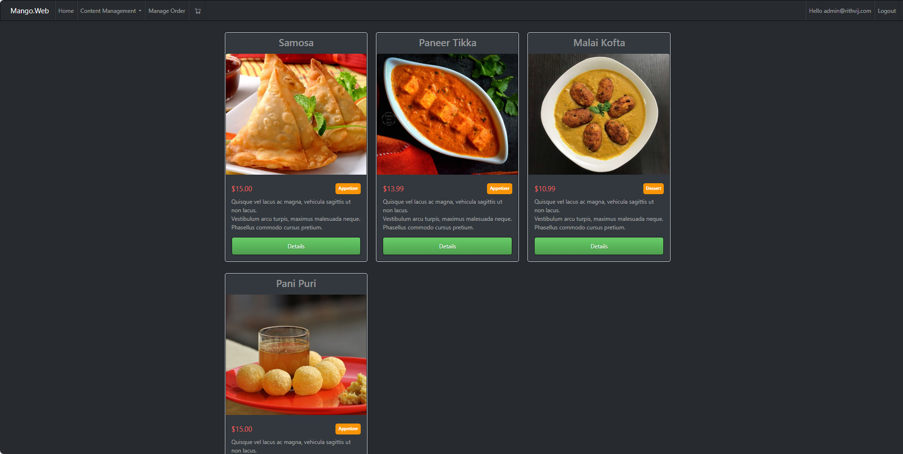

# E-Commerce Microservices Application

This is a complete, production-grade e-commerce microservices application built using **.NET 8**. It features modular microservices, secure authentication using **.NET Identity**, and robust inter-service communication using **Azure Service Bus**. The application is developed with **clean architecture** principles and designed to scale efficiently with best practices in microservices development.

---

## Features

- 7 individual microservices built with .NET 8  
- Authentication and role-based authorization with .NET Identity  
- Asynchronous and synchronous communication via Azure Service Bus  
- Centralized API Gateway using Ocelot  
- Full MVC web application for frontend interaction  
- Modular development covering product, cart, ordering, and payment flows  
- Swagger documentation for all APIs  
- Email notification service  
- Coupon/discount system  
- Follows Clean Architecture and Repository Pattern  

---

## Tech Stack

- **Frontend**: ASP.NET Core MVC, Razor Pages, Bootstrap 5  
- **Backend**: .NET 8 Web APIs (Microservices)  
- **Database**: SQL Server with Entity Framework Core  
- **Authentication**: .NET Identity with role-based access control  
- **API Gateway**: Ocelot  
- **Messaging**: Azure Service Bus (Queues and Topics)  
- **Payment Integration**: Stripe  
- **Deployment**: Microsoft Azure  

---

## Microservices Developed

- **Product Microservice** – Catalog of products/books  
- **Coupon Microservice** – Discount and promotional codes  
- **Shopping Cart Microservice** – Manages cart operations and item persistence  
- **Order Microservice** – Handles order creation, status, and storage  
- **Payment Microservice** – Integrates with Stripe for secure payments  
- **Email Microservice** – Sends transactional email notifications  
- **.NET Identity Microservice** – Centralized authentication and user management  
- **Ocelot API Gateway** – Routes and aggregates microservice APIs  
- **MVC Web Application** – User-facing frontend with admin panel  

---

## App Preview

 
